# Some Incidents of DHA Team Maliciously Attacking My Server

## Main Character: `DHA-アサ獅子`

### First Attack: 6/20

On June 20th, my server [https://dhs.moeyy.cn](https://dhs.moeyy.cn) and other websites were attacked. The day before, on June 19th, DHA's public server(**shit**) was officially launched by `アサ獅子` using AI-generated scripts.

#### Attack Log of My Website:

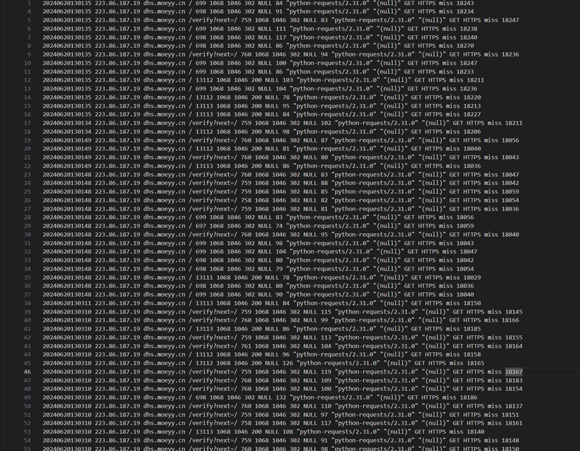

#### DHA Public Server Launch:

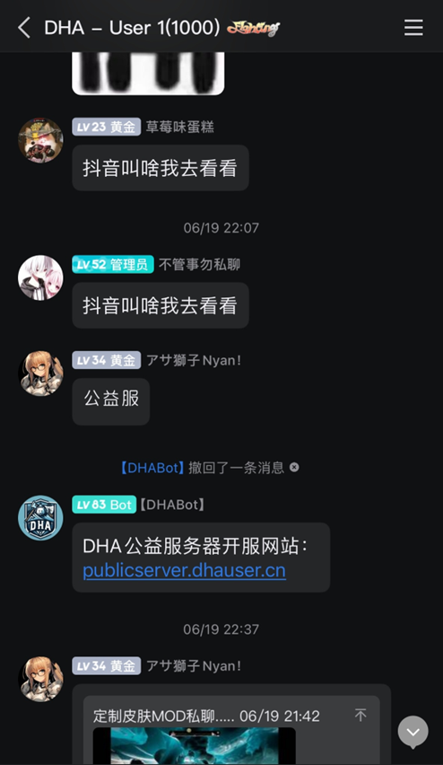

When I checked the IP, it seemed familiar. Isn't it from the same school as `アサ獅子`? To verify, I looked into the previous login IPs when `アサ獅子` used our server.
Because he was once a member of our team and logged into our server, we can trace his login IP.

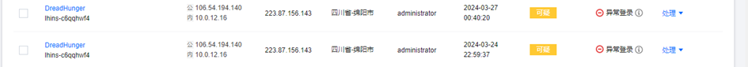

#### IP Comparison:

- `アサ獅子`'s login IP: 223.87.156.143
- Attacker's IP: 220.166.50.62

Both IPs are from the same location: Southwestern University of Finance and Economics, Tianfu College (Mianyang Campus).

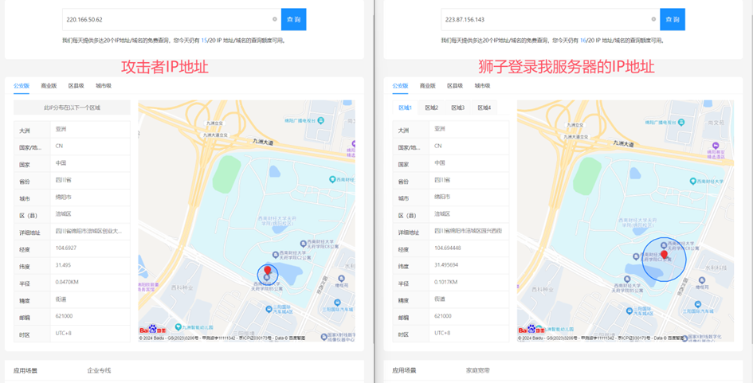

Thus, I confronted `アサ獅子`:

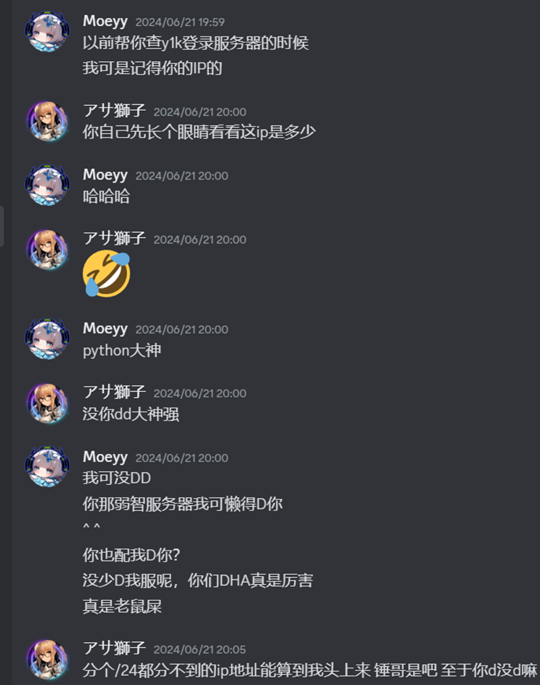

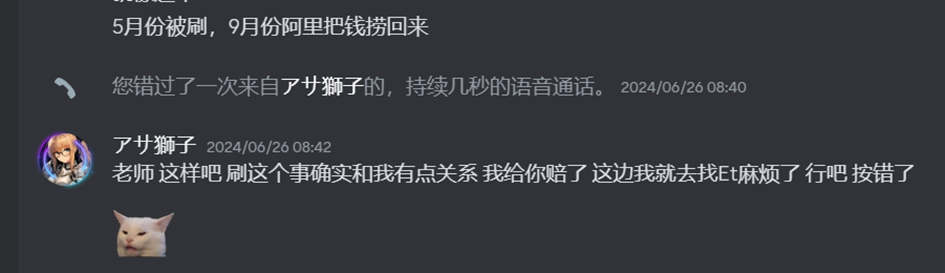

Skipping the small talk, ``アサ獅子 eventually admitted to the attack after I mentioned reporting the attacker's IP to the university. He offered to compensate for my losses. He admitted his wrongdoing, and we didn’t pursue the matter further.

---

### Second Attack: 9/4

TSG team launched a new website offering free plugins and control panel software, which probably upset DHA. `アサ獅子` attacked our server again.

At 16:48, I posted the patch download link: [https://tsg-patch.moeyy.cn](https://tsg-patch.moeyy.cn). By 16:57, `アサ獅子` began scouting my webpage using mobile 4G to hide his IP.

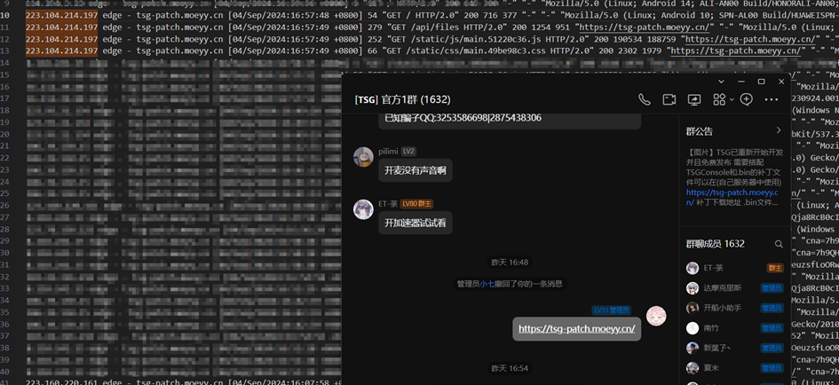

After scouting, he initiated the first attack at around 17:45 using a Japanese IP: 31.223.184.91. The attack had no effect due to frequency limits. Afterward, I blocked access from outside mainland China, except for Hong Kong, Macau, and Taiwan.

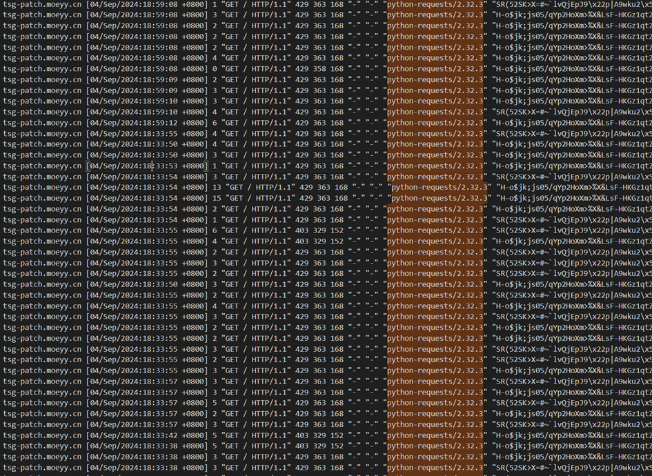

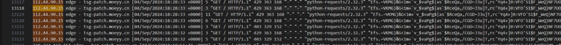

He then attempted an attack using a Hong Kong IP, which was again blocked by frequency limits. Eventually, I discovered his real IP: 112.44.90.15 and confronted him in DC.

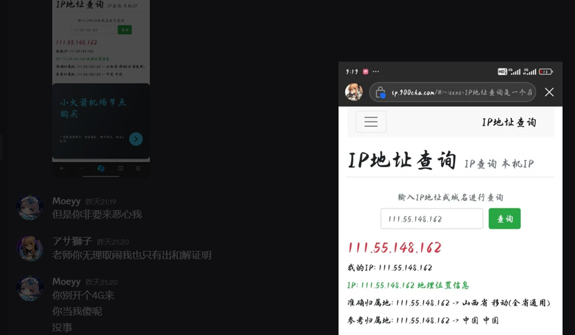

He carelessly exposed his own IP (mobile network)

- `アサ獅子`'s exposed IP: 111.55.148.162
- Attacker's IP: 112.44.90.15

Upon checking, both IPs were from nearly identical locations, less than 1 km apart. The evidence clearly points to `アサ獅子` as the attacker. Despite undeniable proof, he continues to deny it.

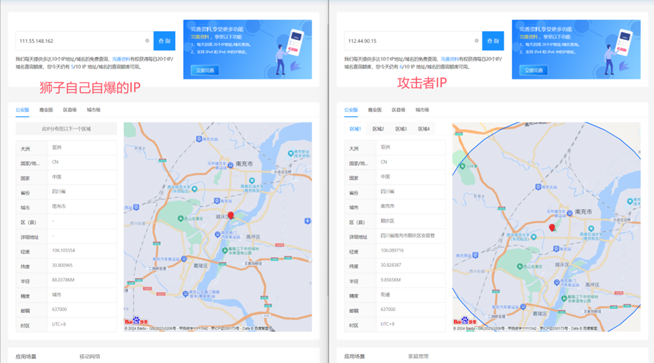

---

### Conclusion:

In DHA, there are a few bad apples who either develop cheats or attack servers. `アサ獅子` is one of them.

### Attack logs:

[Google Drive](https://drive.google.com/drive/folders/16wVX39fCjVbMRznzBgcj9gohd2q4O6-s?usp=sharing)

